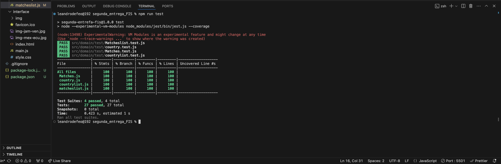
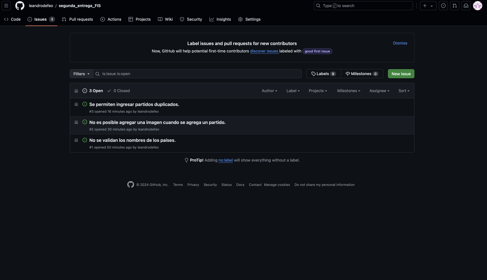

# segunda_entrega_FIS (CA 2024)

## Área: Construcción

Se me pidió simular la página web de la Copa América, para esto implemente dos nuevas pestañas:

- Resumen: En esta pestaña se encuentran los partidos de la Copa América 2024 (esto incluye los resultados, la fecha del mismo, y la etapa de la copa en la que se disputó). También contiene una sección con una tabla que muestra la posición de cada país en su grupo y otra parte con las estadísticas de la copa (los jugadores con mas goles, asistencias, tarjetas amarillas y tarjetas rojas).
- Agregar partido: Esta pestaña permite agregar partidos de forma dinámica (teniendo que ingresar la etapa de la copa, los paises que se enfrentaron, el resultado y la fecha). Estos partidos se van a ver en la pestaña resumen en la sección "más partidos".

Librerías externas:

- Bootstrap: Utilicé bootstrap para los botones, tablas, clases, etc.
- Jest: Jest es un framework de pruebas para JavaScript ampliamente utilizado, principalmente para pruebas unitarias. Este framework te permite escribir pruebas en tu proyecto y luego ejecutarlas.

## Área: Interfaz de usuario

### Usabilidad:

De las heurísticas de Nielsen, las que más están presentes en mi proyecto son:

- Visibilidad del estado del sistema: Esta plantea que el diseño siempre debe mantener informados a los usuarios sobre lo que está sucediendo, a través de comentarios adecuados dentro de un período de tiempo razonable. Este proyecto cumple este requisito, ya que los nombres de las pestañas indican con claridad lo se encuentra en dicha pestaña, y los mensajes de error o éxitos son explicativos respecto a lo que se hizo (o en el caso de ser un mensaje de error se explica a que se debe).
- Consistencia y estándares: Los usuarios no deberían tener que preocuparse por si diferentes palabras, situaciones o acciones significan lo mismo. Esta heurística plantea que se sifan las convenciones de la industria y la plataforma. Para esto intenté utilizar durante todo el proecto las mismas palabras (cuando se muestra un mensaje de error o de confirmación de la acción por ejemplo).
- Prevención de errores: Los buenos mensajes de error son importantes, pero los mejores diseños evitan que ocurran problemas en primer lugar. En este proyecto esto se puede ver en el caso de los campos obligatorios en la pestaña agregar partido, se le marca al usuario que todos los campos son obligatorios, así se evita llegar al mensaje de error "Error: el campo "" no puede ser vacío".
- Diseño estético y minimalista: Las interfaces no deben contener información que sea irrelevante o que rara vez se necesite. Cada unidad adicional de información en una interfaz compite con las unidades de información relevantes y disminuye su visibilidad relativa. La interfaz de usuario de esta web contiene la información relevante y necesaria para el usuario, no se agrega nada que no sea de importancia para el funcionamiento de la misma.
- Que ayude a los usuarios a reconocer, diagnosticar y recuperarse de errores: Los mensajes de error deben expresarse en un lenguaje sencillo (sin códigos de error), indicar con precisión el problema y sugerir una solución de manera constructiva. Como mencione anteriormente, este proyecto ayuda al usuario a no cometer los errores, pero en caso que se cometa algún error se le ayuda a reconocerlo y solucionarlo en lenguaje natural.

### Estándar de accesibilidad WCAG:

Los estandares WCAG son directrices que tienen como objetivo favorecer la accesibilidad de los contenidos web para todas las personas. Para verificar si la interfaz cumple con estos estandares utilicé WAVE como muestro en las imagenes a continación:

- Imagen con errores según estandar:
  

- Imagen con errores solucionados:
  

#### Detalle de los estándares que tuve en cuenta:

Para este proyecto me enfoquue con cumplir los requisitos vistos en clase y en las evaluaciones realizadas:

- Textos alternativos para las imágenes: Cada imagen contiene un texto alternativo que la describe, para que las personas que utilizan lectores de pantalla tengan noción de lo que se encuentra en ese sector.

- Contrastes: No tive ningún error de contraste, esto se debe a que mi página web es en blanco y negro y los botones los diseñe con colores que contrastan bien.

- Formularios accesibles: Me aseguré que los formularios sean accesibles e intuitivos al momento de llenarlos, esto lo hice a través de etiquetas para los campos de entradas, instrucciones claras y mensajes de error faciles de entender. Además utilicé placeholer en los campos de entrada para que detallen aún más lo que se espera en ese campo.

A medida que realizaba algunos cambios me fijaba si había algún error de accesibilidad para solucionarlo de inmediato, em caso contrario seguía realizando los cambios necesarios.

## Área: Codificación

### IDE utilizado y estándar de codificación:

Para la parte de desarrollo utilicé el IDE VSCODE, a medida que realizaba algún cambio en el codigo este lo veía en tiempo real mediante la extensión Live Server (esta extensión abre tu proyecto web en un navegador web predeterminado.)

### Estándares de codificación (Google Style):

- 2.1 File Name: Los nombnres de los archivos deben estar minúscula y separados con (\_) o (-). Mis archivos cumplen con este requisito.

- 2.2 File encoding UTF-8: Los archivos fuente deben estar codificados en UTF-8.

- 6.2.2 Class Names: Los nombres de clases deben estar en UpperCamelCase. CountryList y MatchesList están en UpperCamelCase, cumpliendo con la convención para nombres de clases.
- 6.2.3 Method Names (6.2.3): Los nombres de métodos deben estar en lowerCamelCase, en mi proyecto se cumple (function clearInputs(), function loadCountryList(newCountry), function addMatchToAdditionalList(newMatch), etc).

- 5.8.2.1 Correcto manejo de errores mediante el bloque try-catch. Según el estilo de google estaría mal dejar el "catch" vacío o ignorar el error, pero yo en ningún momento realizo una de esas dos prácticas en mi código.

### Buenas prácticas de Programación orientada a objetos:

- Para lograr una buena práctica de programación y hacer que el código sea lo más claro posible tuve en cuenta algunas cosas. PAra empezar separé mi proyecto en 2 carpetas principales (src y docs), el src tiene 2 secciones principales: La primera es el dominio (domain), en esta sección se encuentran los test y las clases que utilicé para mi proyecto (Country, CountryList, Matches y MatchesList). La otra sección es la de interfaz de usuario (interface), esta contiene una carpeta con algunas imágenes, el index.html, el main.js y el style.css. Esta sección se encarga de todo lo relacionado con la interacción con el usuario.

## Área: Informe de testing

### Test de sistema:

Realicé test unitarios con Jest. Para empezar cree los archivos "Matcheslist.test.js" y "Matches.test.js" que contienen las pruebas unitarias para las clases matcheslist.js y Matches.js respectivamente. Luego ejecuté el comando "npm install" y por último el comando "npm run test" asegurandome de tener 100% de cobertura en las clases del domain y todos los test bien.

### Reporte de issues:

Realicé tres issues correspondientes a mejoras que podría implementar luego en mi proyecto. Para los reportes de issue me basé en el formato visto en las diapositivas del curso, detallado de la siguiente manera; un breve resumen que explique mejora propuesta, mi entorno de trabajo, la severidad, prioridad, los pasos a seguir, el resultado actual y el resultado espero. Además, adjunté una imagen como evidencia de lo planteado en el isue. Con esto garantizo que cada issue esté bien documentado y sea comprensible.

**Issues reportados en GitHub:**

### Informe de calidad del sistema:

La interfaz no contiene ningún error de estilo, esto se debe a que utilicé WAVE (como lo mencioné anteriormente). Sin embargo, podría ser mejorada en cuanto a los colores utilizados para que tenga un diseño más agradable.

En general no encontré ningún error de gravedad alta (ninguno de los issues reportados afecta el funcionamiento de la página web). Sin embargo, sería prudente que sean solucionados a la brevedad para que el usuario que utilice la pagina web tenga la mejor experiencia posible.

### Reflexión:

Este proyecto me pareció sumamente interesante pero complejo a la vez. Para ser sincero, debido a los parciales que tuve no pude dedicarle el tiempo que me hubiese gustado para poder seguir implementando alguna otra pestaña, botón o funcionalidad a las pestañas que ya contiene. Sin embargo, aprendí muchas cosas realizando este trabajo que creo que me van a servir a futuro ya que la realización de páginas web es algo cada vez más solicitado.

Al ser un trabajo individual no tuve un uso muy profundo de GitHub, pero tuve que realizar issues que es algo que nunca había hecho (solo en las evaluaciones realizadas en clase). En algunos momentos me olvidé de realizar commits, y leyendo los que hice, la descripción no fue del todo buena, creo que esto es debido a que sabía que nadie dependía de mi trabajo ni adelantos en el proyecto, por lo que no le presté mucha atención a eso (pido disculpas las disculpas correspondientes).

Para concluir, quiero agradecerles por esta instancia, ya que como mencioné anteriormente me permitió aprender muchas cosas nuevas, además me desafió a trabajar solo en un proyecto con una complejidad no tan baja, un proyecto que seguramente siga desarrollando ya que me pareció entretenido e interasante debido a que es un tema de mi interés (fútbol) sobre una competencia que se acaba de dar (CA 2024).
